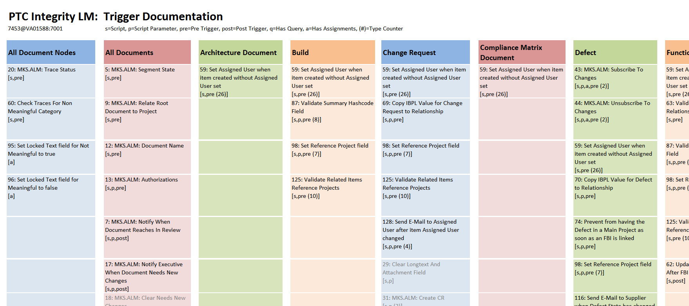

# IntegrityTriggerDoc
Creates an Excel Sheet with Trigger Details and its relationship to Integrity Types

## Purpose
The Trigger Doc utility generates an Excel Sheet with a Trigger Overview. It lists all Trigger names, ordered by Type affected. Additionally, it shows flags identifying the trigger type, if its pre- or post, if it has a script etc.

Why Excel? Initially I thought an html output would be sufficient, but an Excel file is more handy and can be used to track immediately the discussion results to make changes to the trigger configuration. If you need an html file, just save as html :) 



## Use Cases
- As an administrator, I want to get an overview about the triggers defined in my Integrity instance
- As an administrator, I want to get an overview which triggers are related to which Type, and if they are active

## Install
Option 1: In IntegrityClient folder
- Put the "dist/IntegrityTriggerDoc.jar" directly into your IntegrityClient folder
- Copy also all the jar files from "dist/lib/*.jar" into your IntegrityClient/lib folder
- Optional: Add a custom menu entry with:
```
name: Trigger Doc
program:  ../jre/bin/java.exe
parameter: -jar ../IntegrityTriggerDoc.jar
```

Option 2: In a shared folder
- Take all files from "dist" folder and place them somewhere centrally
- Register a custom menu as described before, but with the following change
```
parameter: -jar <your shared folder>/IntegrityTriggerDoc.jar
```

Place the doc/TriggerDocTemplate.xslx into your users home directory at your Windows client.
The Template layout can be tailord to any layout you want. Only the cell position has to stay. 

## How to run
Option 1: Custom Menu
- click Custom > Trigger Doc
- Then review the outcome in your users home, the resulting file name will be somehting like TriggerDoc-2017-11-12.xlsx

Option 2: Command Line
- go into your client folder
- run:  java -jar IntegrityTriggerDoc.jar  (--hostname= --user= --port=)

## Result Analysis 
- Beside the disabled triggers, sometimes another one will appear in black below the others. This is caused by a recent trigger type change. Then, the old rule is kept in Integrity although you may have turned the trigger to "scheduled". Solution: turn it back to "rule", remove the rule. Save. Then reopen and set again to "scheduled". The rule should now be empty. Same belongs to the timing information (pre/post).  

##  Development environment
- PTC Integrity LM 10.9 (also 11.0 should be fine)
- Netbeans 7.4 (or 8)
- Java 1.7 (or 1.8)

## Known Limitations
- The script looks for types in the rule. If you mention 5 types that your trigger will not consider, then the script will not take automatically all others. Instead this trigger might be placed in Excel column "rule" only. The pattern the script is checking is the following only: "field\[Type\]" = "TypeName", "item is segment" => "All Documents", and "item is node/content" => "All Document Nodes"
- The Trigger Doc will not display any specific relationships between triggers, but it will list the position. It can not be determined from the trigger setup if there is a forced before/after rule configured.
- The Template path and name as well as the output file path and name is defined within the code and not flexible yet. It is planned to add another parameters to set that, but it's not implemented yet 
